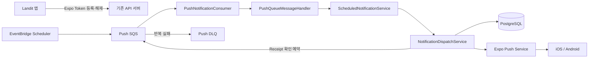

# LAN-184 푸시 알림 백엔드 설계

## 2026-08-29 예약 알림 정책 결정

`SCHEDULED_NOTIFICATION_BATCH`는 EventBridge Scheduler가 매일 20시 `Asia/Seoul` 기준으로 Push Queue에 발행한다. 기존 API 서버의 Consumer가 500명 Keyset 페이지로 활성 사용자를 조회하고, 페이지마다 시나리오·표현·완료 이력·발송 가능한 Token을 일괄 조회한다.

- 사용자 한 명에게 예약 알림은 하루 최대 한 건만 보낸다.
- 20시의 사용자 상태를 기준으로 `DAILY_SCENARIO_REMINDER`, `CONTINUE_EXPRESSION`, `SMALL_TALK_REMINDER` 순서로 하나를 선정한다.
- 당일 시나리오를 완료한 사용자에게 `DAILY_SCENARIO_REMINDER`를 보내지 않는다. 해당 시나리오의 미완료 표현이 있으면 `CONTINUE_EXPRESSION`으로 전환한다.
- 시나리오와 표현을 모두 완료했고 당일 스몰톡을 한 번도 사용하지 않은 사용자에게만 `SMALL_TALK_REMINDER`를 보낸다.
- 모든 조건을 소진했거나 알림할 수 있는 콘텐츠가 없으면 사용자 알림을 보내지 않는다. `REVIEW_LEARNING`은 예약 알림 정책에서 제거한다.
- 계산 결과는 `user_notification_state`에 스냅샷으로 저장한다. 실제 발송은 기존 `push_delivery`의 날짜·사용자·Token 멱등성으로 한 번만 처리한다. 같은 날짜의 재처리 중 알림 유형이 바뀌어도 추가 발송하지 않는다.
- 페이지에서 선점한 Token별 발송 이력은 Expo Push 요청 최대 100건으로 묶어 직접 발송한다. 사용자별 `PUSH_SEND` 메시지를 Push Queue에 다시 넣지 않는다.
- Listener는 `ON_SUCCESS`로 ack하며, 배치 처리 시작과 페이지 전환 시 `Visibility.changeTo(300)`으로 현재 SQS 메시지 visibility를 연장한다.
- Scheduler payload는 `version`, `messageId`, `messageType`, `occurredAt`, 빈 `payload` 객체를 사용한다. Scheduler는 BE 호환 배포 전까지 비활성화한다.

### 발송 시간의 근거

Amplitude `production` 프로젝트(`841657`, `Asia/Seoul`)에서 2026-08-20부터 2026-08-27까지 팀 계정 24개를 제외하고 시간대별 고유 사용자 발생량을 확인했다.

| 이벤트 | 18시~23시 비중 | 최다 발생 시간 |
| --- | ---: | --- |
| `Scenario Talk Started` | 49.3% | 22시 |
| `Small Talk Started` | 49.4% | 22시 |
| `Expression Learning Started` | 49.9% | 22시 |

관측된 `Scenario Talk Completed`의 60.1%는 20시 전에 발생했다. 따라서 20시는 공통 사용 피크인 22시보다 앞서 미완료 사용자를 안내할 수 있고, 이미 완료한 사용자에게는 표현 학습 알림으로 전환할 필요가 있는 시간이다. 기존 20시 예약 시각을 초기 운영값으로 유지한다.

- 분석 차트: [주요 학습 이벤트 시간대 분포](https://app.amplitude.com/analytics/twilight-wind-527959/chart/new/zqlqoiy5)
- 비중은 날짜별 시간대 고유 사용자 수를 합산한 사용자 시간(user-hour) 기준이다. 전체 배정 사용자 중 완료·미완료 비율을 뜻하지 않는다.
- 현재는 시나리오 배정 이벤트와 푸시 수신·열기 이벤트가 없어, 20시의 정확한 미완료율이나 발송 시간의 인과 효과는 판단할 수 없다.

### 사용자별 선정 순서

| 우선순위 | 20시 상태 | 알림 유형 | 대상 |
| ---: | --- | --- | --- |
| 1 | 오늘 배정 시나리오 미완료 | `DAILY_SCENARIO_REMINDER` | 오늘 배정 시나리오 |
| 2 | 오늘 시나리오 완료, 해당 시나리오의 미완료 표현 존재 | `CONTINUE_EXPRESSION` | 표시 순서상 다음 미완료 표현 |
| 3 | 오늘 시나리오와 표현 완료, 오늘 스몰톡 미사용 | `SMALL_TALK_REMINDER` | 스몰톡 시작 화면 |
| - | 위 조건에 해당하지 않음 | 발송하지 않음 | - |

`DAILY_SCENARIO_REMINDER`는 기존 `CONTINUE_SCENARIO`를 대체한다. 과거 전체 시나리오 목록에서 다음 미완료 콘텐츠를 찾지 않고, 현재 시나리오 배정 정책이 반환하는 오늘의 시나리오만 사용한다.

오늘 시나리오가 조회되지 않거나 배정 상태가 비정상이면 다른 콘텐츠 완료로 해석하지 않는다. 사용자에게 잘못된 알림을 보내지 않고 건너뛴 뒤 운영 지표와 로그로 남긴다.

### 스몰톡 알림 조건

- 스몰톡 사용 한도는 KST 날짜별 사용자 발화 60초다.
- KST 자정이 지나 새 날짜가 되면 사용량은 0초, 남은 시간은 60초로 계산한다.
- 초기 정책에서는 `usedSpeakingDurationMs == 0`인 사용자만 `SMALL_TALK_REMINDER` 대상으로 삼는다.
- 일부라도 사용했거나 60초를 모두 사용한 사용자에게는 스몰톡 알림을 보내지 않는다.
- 시나리오를 완료하지 않은 사용자에게는 스몰톡보다 `DAILY_SCENARIO_REMINDER`를 우선한다.

### 운영 후 재검토

발송 시간을 추가로 최적화하려면 알림 유형과 예약 시각을 포함한 수신·열기 이벤트를 계측해야 한다. 이후 19시·20시·21시의 알림 열기율, 4시간 내 대상 콘텐츠 시작률, 당일 완료율을 비교한다. 해당 근거가 쌓이기 전에는 사용자별 발송 시간이나 복수 알림을 도입하지 않는다.

## 현재 범위

이번 구현은 기존 Expo Push Token, 세 가지 학습 알림 정책, 예약 대상 계산, Expo 전달·Receipt 추적까지 책임진다. 나머지 제품 알림 유형과 사용자 행동에 따른 즉시 알림은 후속 작업으로 분리한다.



`PushNotificationConsumer`는 기존 API 애플리케이션 내부 Listener이며 초기 동시성은 2다. 별도 Push Worker는 추가하지 않는다.

## Expo Push Token API

```http
PUT /api/v1/me/expo-push-token
Authorization: Bearer {accessToken}
```

기존 FE 계약을 유지해 `platform`, `expoPushToken`, `enabled`를 받는다. 같은 Expo Token이 이미 존재하면 현재 사용자에게 소유권을 이전하고 활성 상태로 갱신한다.

발송 가능한 Token은 아래 조건을 만족해야 한다.

```text
status == ACTIVE
```

## Queue와 발송

EventBridge는 매일 20시 `SCHEDULED_NOTIFICATION_BATCH` 한 건만 Push Queue에 발행한다.

```json
{
  "version": 1,
  "messageId": "<scheduler execution id>",
  "messageType": "SCHEDULED_NOTIFICATION_BATCH",
  "occurredAt": "<scheduled time>",
  "payload": {}
}
```

`ScheduledNotificationService`는 500명씩 대상을 계산하고, 선정된 사용자의 활성 Token을 대상으로 `push_delivery` 이력을 먼저 선점한다. `NotificationDispatchService`는 페이지에서 선점된 알림을 최대 100건씩 Expo에 보낸다. 중복 방지 키는 `push:{eventId}:{userPushTokenId}`다.

상태는 `REQUESTED → TICKET_ACCEPTED → DELIVERED`이며 실패는 `FAILED`로 기록한다. Ticket 접수 뒤 `PUSH_RECEIPT_CHECK`를 900초 지연 발행하고 Receipt가 준비되지 않으면 최대 세 번 확인한다.

- HTTP 429·5xx·timeout만 같은 발송 이력으로 재시도한다.
- 일반 I/O, interruption, 응답 파싱 실패는 자동 재발송하지 않는다.
- `DeviceNotRegistered`는 발송 당시 Token을 `REVOKED`로 변경한다.
- 같은 예약 Queue 메시지가 다시 전달되면 Expo에 중복 발송하지 않고 재시도 표식이 남은 이력만 다시 발송하며, 누락된 Receipt 예약도 복구한다.
- 배포 전에는 Push Queue와 DLQ에 과거 `PUSH_SEND` 메시지가 남아 있지 않은지 확인한다. 새 Handler는 이 메시지 유형을 지원하지 않으며, 남은 메시지는 DLQ로 이동한다.

## dev 테스트 API

dev에서는 인증 사용자가 아래 API로 자신의 활성 Token에 일반 테스트 알림을 발행한다.

```http
POST /api/v1/internal/test/push
Authorization: Bearer {accessToken}
```

이 API는 `NotificationDispatchService`를 호출해 UserPushToken, Expo, Ticket·Receipt 흐름을 검증한다. `landit.notification.test-api-enabled=true`일 때만 생성되며 prod에는 활성화하지 않는다.

IaC는 dev ECS에 테스트 API 활성화 값을 적용했고 prod에는 주입하지 않았다. 실제 API 사용은 이번 BE 브랜치가 병합·dev 배포된 뒤 가능하다.

## 후속 정책

- 운영 코드에서 생성되지 않는 `review_item READY` 조건과 전용 조회 코드는 사용하지 않는다.
- IaC의 dev·prod Scheduler는 계속 `DISABLED`로 유지한다. 이 문서의 새 대상 선정 정책과 Scheduler 메시지 계약을 구현·검증하기 전에는 활성화하지 않는다.
- IaC는 Queue, DLQ, API Task Role, 환경 변수와 Alarm을 이미 관리한다. visibility timeout은 300초, `maxReceiveCount`는 3, DLQ retention은 14일이다.
