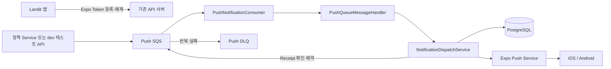

# LAN-184 푸시 알림 백엔드 설계

## 현재 범위

이번 구현은 기존 Expo Push Token과 공통 Push 전달 인프라까지만 책임진다. 대상 선정, 반복 주기, 우선순위, 문구와 딥링크 같은 제품 정책은 후속 PR로 분리한다.



`PushNotificationConsumer`는 기존 API 애플리케이션 내부 Listener이며 초기 동시성은 2다. 별도 Push Worker는 추가하지 않는다.

## Expo Push Token API

```http
PUT /api/v1/me/expo-push-token
Authorization: Bearer {accessToken}
```

기존 FE 계약을 유지해 `platform`, `expoPushToken`, `enabled`를 받는다. 같은 Expo Token이 이미 존재하면 현재 사용자에게 소유권을 이전하고 활성 상태로 갱신한다.

발송 가능한 Token은 아래 조건을 만족해야 한다.

```text
status == ACTIVE
```

## Queue와 발송

확정된 대상 사용자와 알림 내용은 `PUSH_SEND` 메시지로 전달한다.

```json
{
  "version": 1,
  "messageId": "<event id>",
  "messageType": "PUSH_SEND",
  "occurredAt": "<event time>",
  "payload": {
    "userProfileId": 1,
    "notificationType": "TEST_NOTIFICATION",
    "title": "Landit 알림 테스트",
    "body": "푸시 알림이 정상적으로 도착했어요.",
    "deepLink": "/home"
  }
}
```

`NotificationDispatchService`는 메시지의 사용자에게 속한 활성 Token을 조회한다. Token별 `push_delivery` 이력을 먼저 저장하고, 선점된 알림을 최대 100건씩 Expo에 보낸다. 중복 방지 키는 `push:{messageId}:{userPushTokenId}`다.

상태는 `REQUESTED → TICKET_ACCEPTED → DELIVERED`이며 실패는 `FAILED`로 기록한다. Ticket 접수 뒤 `PUSH_RECEIPT_CHECK`를 900초 지연 발행하고 Receipt가 준비되지 않으면 최대 세 번 확인한다.

- HTTP 429·5xx·timeout만 같은 발송 이력으로 재시도한다.
- 일반 I/O, interruption, 응답 파싱 실패는 자동 재발송하지 않는다.
- `DeviceNotRegistered`는 발송 당시 Token을 `REVOKED`로 변경한다.
- 같은 Queue 메시지가 다시 전달되면 Expo에 중복 발송하지 않고 누락된 Receipt 예약만 복구한다.

## dev 테스트 API

dev에서는 인증 사용자가 아래 API로 자신의 활성 Token에 일반 테스트 알림을 발행한다.

```http
POST /api/v1/internal/test/push
Authorization: Bearer {accessToken}
```

이 API는 Expo를 직접 호출하지 않고 `PUSH_SEND`를 Queue에 발행한다. `landit.notification.test-api-enabled=true`일 때만 생성되며 prod에는 활성화하지 않는다.

IaC는 dev ECS에 테스트 API 활성화 값을 적용했고 prod에는 주입하지 않았다. 실제 API 사용은 이번 BE 브랜치가 병합·dev 배포된 뒤 가능하다.

## 후속 정책

- 운영 코드에서 생성되지 않는 `review_item READY` 조건과 전용 조회 코드는 제거한다.
- `user_notification_state`는 알림 정책이 확정된 뒤 별도 이슈와 PR로 추가한다.
- IaC의 dev·prod Scheduler는 계속 `DISABLED`로 유지한다. 제품 정책과 Scheduler 메시지 계약을 구현하기 전에는 활성화하지 않는다.
- IaC는 Queue, DLQ, API Task Role, 환경 변수와 Alarm을 이미 관리한다. visibility timeout은 300초, `maxReceiveCount`는 3, DLQ retention은 14일이다.
