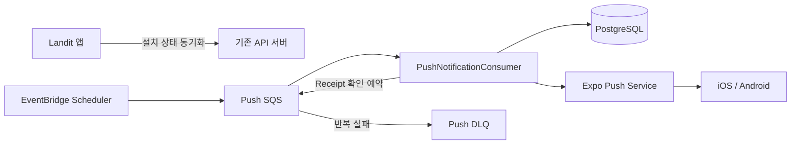

# LAN-184 푸시 알림 백엔드 설계

## 범위

앱 설치별 Expo Token과 Landit 알림 ON/OFF를 관리하고, 별도 Worker 없이 기존 API 서버가 Push 전용 SQS를 소비한다. 이번 구현 알림 유형은 `REVIEW_REMINDER` 하나다.



`PushNotificationConsumer`는 API 애플리케이션 내부 SQS Listener이며, 초기 동시성은 2다. Push Queue는 AI jobs Queue와 분리한다.

## 설치 상태 API

```http
PUT /api/v1/me/push-devices/{installationId}
Authorization: Bearer {accessToken}
```

동일한 `installationId`는 행을 추가하지 않고 현재 사용자, 플랫폼, 수신 설정, Token으로 갱신한다. 같은 Expo Token이 다른 설치에 연결돼 있으면 기존 연결을 해제한다.

| 요청 상태 | 처리 |
| --- | --- |
| `pushEnabled=true`, Token 존재 | `ACTIVE` Token으로 저장 |
| `pushEnabled=true`, Token 없음 | `VALIDATION_FAILED` |
| `pushEnabled=false` | Token은 유지할 수 있지만 발송 대상에서는 제외 |

발송 가능한 설치는 다음 조건을 모두 만족해야 한다.

```text
pushEnabled == true
&& expoPushToken != null
&& tokenStatus == ACTIVE
```

설치 ID와 Token은 각각 unique다. 신규 설치 또는 Token 소유권 이전의 일시적인 DB 충돌은 독립 트랜잭션에서 한 번 재시도한다.

## 복습 리마인더와 전달 결과

- `occurredAt`을 `Asia/Seoul` 날짜로 변환한다.
- 해당 날짜에 `READY` 복습 항목이 있는 활성 사용자를 Cursor 페이지로 조회한다. 한 페이지는 후보 사용자 100명이며, 활성 상태 확인도 페이지 단위로 수행한다.
- 페이지의 모든 발송 가능 설치를 한 번에 조회하고, 사용자별 모든 설치로 한 번씩 보낸다.
- 중복 방지 키는 `review-reminder:{date}:{userId}:{pushDeviceId}`다.
- 제목·본문·딥링크는 `복습할 시간이에요`, `오늘의 표현을 다시 볼까요?`, `/expressions?utm_source=push&utm_medium=notification&utm_campaign=review_reminder`다.

Expo 호출 전에 설치별 `push_delivery` 이력을 선점한다. 이력은 멱등성, Ticket, Receipt를 설치별로 추적하므로 묶지 않는다. 선점된 메시지만 최대 100건씩 Expo Push API 요청 배열로 전송하고, 응답 Ticket은 요청 순서대로 각 발송 이력에 기록한다. 상태는 `REQUESTED → TICKET_ACCEPTED → DELIVERED`이며, Ticket 또는 Receipt 오류는 `FAILED`로 기록한다. Ticket 접수 뒤 `PUSH_RECEIPT_CHECK`를 900초 지연 발행하고, Receipt가 준비되지 않으면 최대 세 번 확인한다.

- HTTP 429·5xx·timeout만 같은 발송 이력으로 재시도한다.
- Expo 요청 전체의 일시 오류면 해당 요청 묶음의 모든 발송 이력을 재시도 가능 상태로 표시한다.
- 일반 I/O, interruption, 응답 파싱 실패는 자동 재발송하지 않는다.
- `DeviceNotRegistered`는 발송 당시 Token과 현재 Token이 같은 설치만 `INVALID`로 변경한다.
- 배치 재전달은 기존 `TICKET_ACCEPTED` 이력의 Receipt 확인만 다시 예약하며 Expo를 다시 호출하지 않는다.

## Queue와 dev 테스트 API

Scheduler는 `Asia/Seoul` 매일 20시에 아래 메시지를 발행한다. Consumer는 `REVIEW_REMINDER_BATCH`와 `PUSH_RECEIPT_CHECK`를 구분해 처리한다.

```json
{
  "version": 1,
  "messageId": "<scheduler execution id>",
  "messageType": "REVIEW_REMINDER_BATCH",
  "occurredAt": "<scheduled time>",
  "payload": {}
}
```

dev에서는 인증 사용자가 `POST /api/v1/internal/test/push/review-reminder`로 같은 배치 메시지를 즉시 발행할 수 있다. 이 API는 Expo를 직접 호출하지 않으며, `landit.notification.test-api-enabled=true`일 때만 생성된다. 기본값은 `false`이고 prod에는 활성화 환경 변수를 주입하지 않는다.

## 인프라 원칙

IaC는 Queue, DLQ, Scheduler, API Task Role, 환경 변수와 Alarm을 관리한다. Scheduler는 dev·prod 모두 최초 `DISABLED`로 유지한다. visibility timeout은 300초, `maxReceiveCount`는 3, DLQ retention은 14일이다.

dev 테스트 API 활성화 환경 변수는 IaC commit `9a22e16`에 반영됐고 Terraform validate·plan까지 확인됐다. 해당 변경의 apply와 dev BE 배포, 실기기 E2E 검증은 아직 남아 있다.
