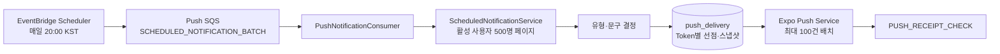

# LAN-184 예약 푸시 개인화 정책 설계

## 목표와 성공 조건

매일 20시 `Asia/Seoul` 기준으로 활성 Expo Token이 있는 사용자에게 학습 상태에 맞는 예약 푸시를 하루 최대 한 건 보낸다. 같은 사용자와 예약 날짜를 다시 처리해도 무작위 선택이 바뀌지 않아야 하며, 발송 이력에서 알림 유형과 문구 변형을 분석할 수 있어야 한다.

성공 조건은 다음과 같다.

- 오늘의 시나리오를 결정할 수 없으면 발송하지 않는다.
- 오늘 시나리오가 미완료면 다른 학습 상태와 관계없이 `DAILY_SCENARIO_REMINDER`를 선택한다.
- 오늘 시나리오를 완료한 뒤 표현과 스몰톡이 모두 가능하면 결정적 50:50으로 하나만 선택한다.
- 날짜·사용자·결정 범위가 같으면 서버 재시작과 SQS 재전달 후에도 같은 선택 인덱스를 얻는다.
- `push_delivery`의 기존 날짜·사용자·Token 멱등성 경계와 제목·본문·딥링크 스냅샷을 유지한다.
- 예약 알림의 `notification_type`과 `content_variant`를 `push_delivery`에서 조회할 수 있다.
- 닉네임, 표현, 스몰톡 주제의 미해결 치환 문자열이 사용자에게 노출되지 않는다.

## 범위

이번 변경은 기존 `SCHEDULED_NOTIFICATION_BATCH` 대상 조회, 사용자별 유형 선택, 문구 생성, 발송 이력 스냅샷에 개인화 정책을 추가한다. 아래 흐름과 외부 계약은 변경하지 않는다.



- 기존 `PUT /api/v1/me/expo-push-token`과 `UserPushToken` API를 유지한다.
- `status = 'ACTIVE'`인 Expo Token이 하나 이상 있는 사용자만 발송 후보로 처리한다.
- 별도 Worker와 사용자별 `PUSH_SEND` Queue 메시지를 추가하지 않는다.
- Expo Ticket·Receipt 상태 전이, 100건 배치, 재시도 정책과 Token 무효화 정책을 유지한다.
- 딥링크 경로 `/conversation/scenario/{scenarioId}`, `/expressions/scenario/{scenarioId}/{expressionId}`, `/smalltalk`를 유지한다.
- UTM 변경과 FE 로컬 알림 제거는 이 정책 구현 범위에 포함하지 않는다.

## 예약 날짜와 일일 멱등성

`ScheduledNotificationService`는 Scheduler의 `occurredAt`을 `Asia/Seoul`로 변환해 `scheduledDate`를 계산한다. 시스템 현재 시각이나 서버 기본 시간대를 예약 날짜 판정에 사용하지 않는다.

사용자 일일 이벤트 ID는 기존 값을 그대로 사용한다.

```text
scheduled:{scheduledDate}:{userProfileId}
```

Token별 중복 방지 키도 기존 경계를 유지한다.

```text
push:{eventId}:{userPushTokenId}
```

따라서 한 사용자가 여러 활성 Token을 보유하면 Token마다 한 번 발송할 수 있지만, 같은 사용자·날짜·Token 조합은 재전달돼도 새 이력을 만들지 않는다. 이미 `push_delivery`가 생성된 뒤의 재시도는 현재 계산 결과가 아니라 저장된 Token·제목·본문·딥링크 스냅샷을 다시 사용한다.

## 대상 조회 스냅샷

`NotificationTargetPageQueryService`는 활성 사용자 500명 페이지마다 다음 값을 일괄 조회해 `NotificationTargetSelectionInput`을 만든다.

| 필드 | 출처와 규칙 |
| --- | --- |
| `userProfileId` | `user_profile.id` |
| `nickname` | `user_profile.nickname`; `null` 또는 `isBlank()`면 이름 없음 |
| `dailyScenarioId`, `dailyScenarioCompleted` | 기존 오늘 시나리오 결정 규칙 유지 |
| `freeTalkUsedSpeakingDurationMs` | `free_talk_daily_speaking_usage`의 `usage_date = scheduledDate`; 행이 없으면 `0` |
| `activeToday` | `user_daily_activity.activity_date = scheduledDate AND active_day = true` |
| `activeYesterday` | `user_daily_activity.activity_date = scheduledDate - 1 AND active_day = true` |
| `currentStreakDays`, `longestStreakDays` | `user_learning_activity_summary`; 행이 없으면 `null` |
| `priorActiveDayHistory` | `scheduledDate` 이전에 `active_day = true`인 행이 하나 이상인지 여부 |
| `missedDayCount` | 마지막 과거 active day 다음 날부터 `scheduledDate - 1`까지의 날짜 수 |
| `latestFreeTalkTitle` | 사용자의 가장 최근 `free_talk_session` 제목 |
| `expressions` | 기존 시나리오·언어·상태·`display_order`, 완료 여부에 `target_expression_text`를 추가 |

`missedDayCount`는 오늘을 제외한다. 마지막 active day가 `lastActiveDate`일 때 아래 식을 사용한다.

```text
missedDayCount = DAYS.between(lastActiveDate, scheduledDate) - 1
```

`lastActiveDate`는 `scheduledDate`보다 이전인 `active_day = true` 행만 대상으로 한다. 과거 active day가 없으면 `priorActiveDayHistory = false`, `missedDayCount = null`이다. 과거 이력은 있다고 알려졌지만 유효한 날짜 차이를 만들 수 없는 방어적 입력도 `missedDayCount = null`로 유지한다.

가장 최근 프리톡은 `learning_session.started_at DESC, learning_session.id DESC`로 하나를 고른다. 상태와 관계없이 가장 최근에 시작한 대화의 제목을 사용하되, 그 제목이 비어 있거나 길이 제한을 넘으면 더 오래된 제목으로 대체하지 않고 일반 문구를 쓴다. 오래된 주제를 현재 대화처럼 알리는 것을 피하기 위한 규칙이다.

표현 후보는 `writing_expression.display_order ASC, writing_expression.id ASC` 순서를 유지한다. `CONTINUE_EXPRESSION`은 오늘 완료한 시나리오에 속한 첫 미완료 표현을 선택한다.

## 알림 유형 선택

선택 순서는 다음과 같다.

1. `dailyScenarioId == null`이면 경고 로그를 남기고 건너뛴다.
2. `dailyScenarioCompleted == false`이면 항상 `DAILY_SCENARIO_REMINDER`다.
3. 오늘 시나리오의 첫 미완료 표현이 있으면 표현이 eligible하다.
4. `freeTalkUsedSpeakingDurationMs == 0`이면 스몰톡이 eligible하다.
5. 표현과 스몰톡이 모두 eligible하면 `NOTIFICATION_TYPE` 결정 범위에서 결정적 50:50으로 `CONTINUE_EXPRESSION` 또는 `SMALL_TALK_REMINDER`를 선택한다.
6. 하나만 eligible하면 해당 유형을 선택한다.
7. 둘 다 eligible하지 않으면 건너뛴다.

스몰톡을 1ms라도 사용했다면 스몰톡은 eligible하지 않다. 표현과 스몰톡의 동시 eligibility에서 목록 순서는 항상 `[CONTINUE_EXPRESSION, SMALL_TALK_REMINDER]`로 고정한다.

## 결정적 균등 선택

무작위 상태나 프로세스 seed를 저장하지 않는다. 아래 canonical key의 SHA-256 digest 첫 8바이트를 big-endian signed `long`으로 읽고 `Math.floorMod(value, candidateCount)`를 사용한다.

```text
v1|{decisionScope}|{scheduledDate}|{userProfileId}
```

문자열 인코딩은 UTF-8, 날짜는 ISO-8601 `yyyy-MM-dd`다. `candidateCount <= 0`은 호출 계약 위반으로 `IllegalArgumentException`을 던진다.

결정 범위는 정확히 두 개를 사용한다.

```text
scheduled-notification:type:v1
scheduled-notification:content:v1
```

유형 선택과 문구 선택이 같은 hash 값을 공유하지 않도록 범위를 분리한다. 후보 목록은 아래 문서에 적힌 순서를 바꾸지 않는다. 후보 수가 2인 유형 선택은 각 인덱스가 정확히 절반의 64-bit hash residue를 받으며, 나머지 문구 pool도 같은 방식으로 균등 선택한다.

## 시나리오 알림 문구

### 어제 스트릭을 달성한 경우

`activeYesterday == true`, `activeToday == false`, `currentStreakDays != null`, `longestStreakDays != null`, `currentStreakDays + 1 > longestStreakDays`가 모두 참이면 A4를 강제로 사용한다. `expectedStreakDays = currentStreakDays + 1`이다.

| variant | 제목 | 본문 |
| --- | --- | --- |
| `SCENARIO_A4` | `🚨 오늘의 시나리오를 깨면 연속 {expectedStreakDays}일 달성` | `5분 투자로 최고 기록을 달성해보세요!` |

위 조건이 아니면 `CONTENT_VARIANT` 결정 범위로 `[SCENARIO_A1, SCENARIO_A2, SCENARIO_A3]`에서 균등 선택한다.

| variant | 제목 | 본문 |
| --- | --- | --- |
| `SCENARIO_A1` | `오늘만 가능한 시나리오 도착 💌` | `자기 전 5분으로 래디에게 열매를 먹여주세요` |
| `SCENARIO_A2` | `어떤 하얀 뱁새가 그러는데,,` | `오늘이 지나면 이 시나리오가 사라진대요😵‍💫\n자기 전 5분만 투자하세요` |
| `SCENARIO_A3` | `오늘 학습 포기하실 건가요? 🥺` | `5분만 투자하면 열매를 얻을 수 있어요.\n오늘만 할 수 있는 시나리오가 당신을 기다리고 있어요 💌` |

### 어제 스트릭을 달성하지 못한 경우

기본 후보 pool은 다음과 같다.

| 상태 | 순서가 고정된 후보 pool |
| --- | --- |
| 과거 active-day 이력 없음 | `[SCENARIO_R0]` |
| `missedDayCount == 1` | `[SCENARIO_R0, SCENARIO_R1]` |
| `missedDayCount == 2 or 3` | `[SCENARIO_R1, SCENARIO_R2, SCENARIO_R5]` |
| `missedDayCount >= 4` | `[SCENARIO_R2, SCENARIO_R3, SCENARIO_R4, SCENARIO_R5, SCENARIO_R6]` |
| 과거 이력은 있으나 `missedDayCount == null` | `[SCENARIO_R0]` |

마지막 행은 잘못된 `n`이나 장기 미접속 뉘앙스를 보내지 않기 위한 보수적 fallback이다. 이후 아래 필터를 순서대로 적용한다.

- 닉네임이 `null` 또는 `isBlank()`면 R2, R3, R5를 제거한다.
- `missedDayCount == null`이면 R2를 제거한다.
- 필터 결과가 비면 R0 하나를 사용한다.
- 최종 pool을 `CONTENT_VARIANT` 결정 범위로 균등 선택한다.

| variant | 제목 | 본문 |
| --- | --- | --- |
| `SCENARIO_R0` | `어떤 하얀 뱁새가 그러는데,,` | `오늘이 지나면 이 시나리오가 사라진대요😵‍💫\n자기 전 5분만 투자하세요` |
| `SCENARIO_R1` | `공든 탑이 무너지랴` | `어제 못했어도 오늘 공부하면 돼요‼️\n자기 전 5분으로 다시 학습을 시작하세요` |
| `SCENARIO_R2` | `{missedDayCount}일째 {nickname}님을 기다리고 있어요…` | `배고픈 래디에게 열매를 주세요😭` |
| `SCENARIO_R3` | `포기도 습관이다!` | `하지만 {nickname}님은 아직입니다!!\n습관이 되기 전에 영어 공부 5분만 해봐요🥺` |
| `SCENARIO_R4` | `우리가 마음에 안 드시나요..?` | `영어 공부를 안 하시는 이유가 궁금해요.` |
| `SCENARIO_R5` | `어라 이상하다 왜 공부하러 안 오지?` | `{nickname}님이 이럴 사람이 아닌데…` |
| `SCENARIO_R6` | `제가 어떻게 해야 공부하러 오실까요?` | `제발 5분만 영어 공부해요 우리` |

표의 `{...}`는 코드에서 값을 삽입할 위치를 설명할 뿐이며 실제 문자열에 `{nickname}`, `{missedDayCount}`, `OO`를 남기지 않는다.

## 표현 알림 문구

선택한 `ExpressionNotificationCandidate.targetExpressionText`가 `null` 또는 `isBlank()`가 아니고, 완성된 제목이 Unicode code point 기준 255자 이하면 동적 문구를 사용한다.

| variant | 제목 | 본문 |
| --- | --- | --- |
| `EXPRESSION_DYNAMIC` | `“{targetExpressionText}”, 어떤 상황에서 쓸까요?` | `오늘 시나리오에서 이어지는 표현을 배워보세요.` |
| `EXPRESSION_GENERIC` | `표현 학습을 이어가 볼까요?` | `오늘 시나리오에서 이어지는 표현을 배워보세요.` |

빈 문자열이거나 완성 제목이 255자를 넘으면 `EXPRESSION_GENERIC`을 사용한다. 255자는 현재 `push_delivery.title VARCHAR(255)`의 저장 계약에서 나온 최소 기술 제한이다. `String.length()` 대신 `codePointCount`를 사용해 보조 평면 문자를 두 글자로 잘못 계산하지 않는다.

## 스몰톡 알림 문구

`latestFreeTalkTitle`이 `null` 또는 `isBlank()`가 아니고, 완성된 본문이 Unicode code point 기준 500자 이하면 동적 문구를 사용한다.

| variant | 제목 | 본문 |
| --- | --- | --- |
| `SMALL_TALK_DYNAMIC` | `하던 얘기 이어서 해봐요` | `{latestFreeTalkTitle} 이야기, 테디와 조금 더 나눠볼까요?` |
| `SMALL_TALK_GENERIC` | `오늘은 스몰톡 안 하시나요? 🥺` | `테디가 당신과의 대화를 애타게 기다려요.` |

빈 문자열이거나 완성 본문이 500자를 넘으면 `SMALL_TALK_GENERIC`을 사용한다. 500자는 현재 `push_delivery.body VARCHAR(500)`의 저장 계약에서 나온 최소 기술 제한이다. 표현과 마찬가지로 Unicode code point 수로 비교한다.

## 문구 생성과 딥링크 계약

`ScheduledNotificationContent`는 `contentVariant`, `title`, `body`, `deepLink`를 반환한다. 유형별 딥링크는 다음과 같다.

| 유형 | 딥링크 |
| --- | --- |
| `DAILY_SCENARIO_REMINDER` | `/conversation/scenario/{scenarioId}?utm_source=push&utm_medium=notification&utm_campaign=daily_scenario_reminder` |
| `CONTINUE_EXPRESSION` | `/expressions/scenario/{scenarioId}/{expressionId}?utm_source=push&utm_medium=notification&utm_campaign=continue_expression` |
| `SMALL_TALK_REMINDER` | `/smalltalk?utm_source=push&utm_medium=notification&utm_campaign=small_talk_reminder` |

기존 UTM 값도 이번 정책 변경에서는 유지한다. 문구 생성은 선택 대상과 동일한 `NotificationTargetSelectionInput`, `scheduledDate`를 받아 동적 값과 결정적 문구 variant를 만든다.

## 발송 이력과 관측

현재 `push_delivery`는 `notification_type`, `title`, `body`, `deep_link`를 이미 Token별로 스냅샷한다. 문구 variant를 제목에서 역추론하지 않도록 nullable `content_variant VARCHAR(40)` 컬럼만 추가한다.

- 예약 알림은 항상 `content_variant`를 저장한다.
- dev 수동 `TEST_NOTIFICATION`처럼 variant 정책이 없는 알림은 `null`을 저장한다.
- 기존 행은 migration에서 backfill하지 않고 `null`로 유지한다. 과거 제목을 기반으로 variant를 추측하지 않는다.
- `NotificationContentVariant` enum 값은 A1-A4, R0-R6, 표현 동적/일반, 스몰톡 동적/일반을 명시한다.
- structured log에는 `userProfileId`, `scheduledDate`, `notificationType`, `contentVariant`만 기록하고 닉네임·표현·주제·전체 제목·본문은 기록하지 않는다.

Flyway는 `classpath:db/migration`과 `classpath:db/{vendor}`를 함께 읽는다. 현재 체크아웃의 전체 위치를 합치면 최고 버전은 공통 migration의 V71이므로 새 migration은 `V72__add_push_delivery_content_variant.sql`로 만든다. H2와 PostgreSQL에 동일한 `ALTER TABLE ... ADD COLUMN`을 적용할 수 있어 vendor별 파일은 추가하지 않는다.

## 재시도와 상태 변경

결정적 hash는 동일한 사용자·날짜·후보 pool에서 같은 유형과 문구 variant를 보장한다. 발송 선점 뒤에는 `PushDeliveryService`가 저장된 스냅샷으로 재시도하므로 사용자 상태나 동적 원문이 바뀌어도 이미 선점된 Push 내용은 바뀌지 않는다.

`push_delivery` 선점 전에 사용자의 실제 학습 상태가 바뀌면 재처리 시 eligibility 자체는 다시 평가한다. 이는 오래된 알림을 보내지 않기 위한 기존 실시간 평가 동작이며, 결정적 선택 요구는 같은 정책 입력에서의 무작위 선택 안정성에 적용한다. 같은 날짜에 이미 하나의 Token이라도 선점됐다면 기존 일일 event ID로 해당 Token에 다른 유형을 추가 발송하지 않는다.

## 오류와 개인정보 처리

- 오늘 시나리오 불명은 `daily_scenario_unavailable`로 기록하고 건너뛴다.
- 후보 수 0인 결정적 선택 호출은 프로그래밍 오류로 즉시 실패시킨다. 정상 정책 분기는 빈 pool을 R0로 복구한 뒤 호출한다.
- 닉네임, 표현 원문, 프리톡 주제, 완성 제목·본문은 로그에 기록하지 않는다.
- 표현 또는 주제가 비었거나 저장 길이를 넘으면 내용을 자르지 않고 일반 문구로 바꾼다.
- `OO`, `{nickname}`, `{missedDayCount}`, `{expectedStreakDays}`, `{targetExpressionText}`, `{latestFreeTalkTitle}` 같은 치환 표식은 최종 제목·본문에 포함될 수 없다.

## 검증 경계

구현 완료의 최소 증거는 다음과 같다.

- 유형 eligibility와 결정적 50:50 단위 테스트.
- A1-A4, R0-R6 pool·개인화 제외·fallback 단위 테스트.
- 표현과 스몰톡의 정확한 문구, 개행, 255/500 code point 경계 테스트.
- 날짜별 활동, streak, missed-day, 최신 프리톡 제목, 표현 순서를 검증하는 H2 통합 테스트.
- `content_variant` migration과 `PushDelivery` 스냅샷 통합 테스트.
- 같은 사용자·날짜를 두 번 처리한 command의 유형·variant·제목·본문·딥링크 동일성 테스트.
- 기존 500명 페이지, Expo 100건 배치, Ticket·Receipt, 활성 Token, 일일 event ID 테스트 회귀.
- 최종 `./gradlew check`와 `git diff --check` 통과.

실제 Scheduler 활성화, 배포, 실기기 노출은 코드·테스트 완료와 별도 운영 검증이다.
