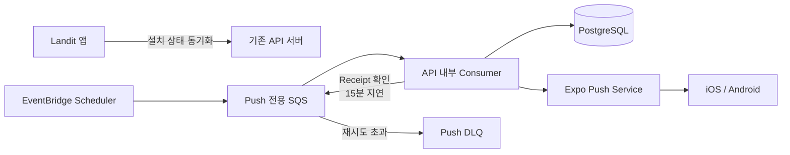

# LAN-184 푸시 알림 백엔드 설계

## 목표와 범위

앱 설치 단위로 Expo Push Token과 Landit 알림 ON/OFF 상태를 관리한다. 별도 Worker를 배포하지 않고 기존 API 서버가 Push 전용 SQS를 소비한다. 이번 작업의 발송 유형은 복습 리마인더 하나다.



기존 AI jobs Queue와 Push Queue는 분리한다. `PushNotificationConsumer`는 별도 서버가 아니라 API 애플리케이션 내부의 SQS Listener이며 초기 동시성은 2다.

## 공개 API

클라이언트 API는 하나다.

```http
PUT /api/v1/me/push-devices/{installationId}
Authorization: Bearer {accessToken}
```

`installationId`는 앱이 최초 설치 시 생성하고 로컬 저장소에 유지하는 UUID다.

```json
{
  "platform": "IOS",
  "pushEnabled": true,
  "expoPushToken": "ExponentPushToken[xxxxxxxxxxxxxxxxxxxxxx]"
}
```

| 요청 상태 | 처리 |
| --- | --- |
| `pushEnabled=true`, Token 존재 | Token을 `ACTIVE`로 저장 |
| `pushEnabled=true`, Token 없음 | `VALIDATION_FAILED` |
| `pushEnabled=false`, Token 존재 | Token을 유지하고 발송 대상에서 제외 |
| `pushEnabled=false`, Token 없음 | Token 연결을 해제하고 비활성 상태로 저장 |

동일한 `installationId`는 행을 추가하지 않고 현재 사용자, 플랫폼, 설정, Token으로 갱신한다. 같은 Token이 다른 설치에 연결돼 있으면 기존 연결을 해제한다. 유효한 Token을 다시 동기화하면 `ACTIVE`로 복원한다.

신규 설치 또는 Token 소유권 이전이 동시에 요청돼 unique 충돌이나 일시적인 잠금 실패가 발생하면 `REQUIRES_NEW` 동기화 트랜잭션을 한 번 다시 실행한다. 재시도에도 실패하면 원래 DB 예외를 반환하며 애플리케이션 인스턴스 전용 Lock이나 별도 Lock 테이블은 두지 않는다.

응답은 설치 ID, 플랫폼, 수신 여부, 발송 가능한 Token 등록 여부, 수정 시각을 반환하며 Token 원문은 포함하지 않는다.

## 설치와 발송 이력

기존 `user_push_token` 테이블은 유지하고 Java 도메인 이름을 `PushDevice`로 변경한다.

| `PushDevice` 필드 | 규칙 |
| --- | --- |
| `installationId` | 앱 설치 UUID, unique |
| `userProfileId` | 현재 인증 사용자 |
| `platform` | `IOS`, `ANDROID` |
| `pushEnabled` | Landit 알림 수신 여부 |
| `expoPushToken` | nullable, 값이 있으면 unique |
| `tokenStatus` | Token이 있으면 `ACTIVE` 또는 `INVALID` |

발송 대상 조건은 다음과 같다.

```text
pushEnabled == true
&& expoPushToken != null
&& tokenStatus == ACTIVE
```

`push_delivery`에는 사용자, 설치, 실제 발송 Token, 알림 유형, 중복 방지 키, 메시지, Expo Ticket ID, 상태와 오류 코드를 저장한다. `DeviceNotRegistered`는 발송 당시 Token을 현재 소유한 설치만 무효화하며, 그 사이 교체된 새 Token에는 영향을 주지 않는다.

## 복습 리마인더

- 기준 날짜에 `READY` 복습 항목이 있는 활성 사용자만 조회한다.
- 발송 가능한 설치가 여러 개면 설치별로 발송한다.
- 중복 방지 키는 `review-reminder:{date}:{userId}:{pushDeviceId}`다.

```json
{
  "to": "ExponentPushToken[...]",
  "title": "복습할 시간이에요",
  "body": "오늘의 표현을 다시 볼까요?",
  "data": {
    "url": "/expressions?utm_source=push&utm_medium=notification&utm_campaign=review_reminder"
  },
  "sound": "default",
  "channelId": "default"
}
```

## Ticket, Receipt와 재시도

상태는 `REQUESTED → TICKET_ACCEPTED → DELIVERED`로 전환하며 Ticket 또는 Receipt 오류는 `FAILED`로 기록한다.

- Expo 호출 전에 발송 이력을 선점해 SQS 재전달의 중복 발송을 막는다.
- 명시적인 일시 오류를 재시도할 때는 잠긴 발송 이력의 재시도 표식을 먼저 소비해 한 Consumer만 Expo를 호출한다.
- Ticket 접수 후 Receipt 메시지 발행이 실패하면 재전달된 배치가 현재 사용자·복습·설치 상태와 무관하게 기준 날짜의 `TICKET_ACCEPTED` 이력을 먼저 찾아 Expo를 다시 호출하지 않고 Receipt 메시지만 발행한다.
- 배치 중복 전달로 Receipt 메시지가 중복 발행돼도 첫 최종 결과 기록 이후 나머지 메시지는 처리하지 않는다.
- Receipt가 준비되지 않으면 900초 뒤 다시 확인하며 최대 3회 시도한다.
- `DeviceNotRegistered`는 발송 당시 Token과 현재 Token이 일치할 때만 `INVALID`로 변경한다.
- HTTP 429·5xx·timeout은 같은 `REQUESTED` 이력으로 재시도한다.
- interruption, 일반 I/O 오류, 정상 응답 파싱 실패처럼 Expo 수신 여부를 알 수 없는 `REQUESTED` 이력은 자동 재발송하지 않는다.
- 한 설치의 발송이 실패해도 나머지 설치를 계속 처리하고, 전체 순회 뒤 첫 오류를 다시 던져 SQS 재시도를 유지한다.

Expo 네트워크 호출 중에는 DB 트랜잭션을 유지하지 않는다.

## SQS 메시지

EventBridge Scheduler는 다음 메시지를 매일 `Asia/Seoul` 20시에 발행한다.

```json
{
  "version": 1,
  "messageId": "<aws.scheduler.execution-id>",
  "messageType": "REVIEW_REMINDER_BATCH",
  "occurredAt": "<aws.scheduler.scheduled-time>",
  "payload": {}
}
```

백엔드는 `occurredAt`을 `Asia/Seoul`로 변환해 복습 날짜를 계산한다. 같은 Queue에서 `PUSH_RECEIPT_CHECK`도 처리하며 지원하지 않는 version이나 유형은 실패시켜 SQS 재시도와 DLQ 대상으로 남긴다.

## 인프라와 배포

IaC 작업 `019f8fd8-2ef1-7243-a11c-63c2bb3f03a4`에서 dev와 prod의 Queue, DLQ, API IAM·환경 변수, Scheduler와 CloudWatch Alarm을 구현했다.

- Scheduler는 dev와 prod 모두 최초 `DISABLED`다.
- visibility timeout은 300초, `maxReceiveCount`는 3, DLQ retention은 14일이다.
- Terraform apply와 Scheduler 활성화는 dev BE 배포 전까지 보류한다.
- prod plan의 범위 밖 Athena·Glue 4개 생성은 분리 또는 정합화 전까지 apply하지 않는다.

실제 환경 검증 항목과 IaC plan 결과는 `plan.md`에 기록한다.
