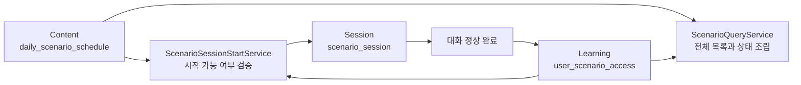

# LAN-219 일일 시나리오 접근 정책 설계

## 목표

모든 사용자에게 한국 시간 기준 하루에 하나의 같은 시나리오를 제공한다. 사용자는 배정일 안에 오늘의 시나리오를 시작해야 한다. 시작하지 못한 시나리오는 잠기며 다음 날 자동으로 따라오지 않는다.

새 정책에서 완료한 시나리오는 이후 언제든 복습할 수 있다. 기존 완료 기록은 삭제하지 않지만 새 정책의 클리어와 복습 권한에는 반영하지 않는다.

## 확정 범위

- 운영자가 날짜별 전역 시나리오를 직접 등록할 수 있는 DB 구조를 추가한다.
- `GET /api/v1/scenarios`는 모든 카테고리와 시나리오를 계속 반환한다.
- 각 시나리오를 `CLEARED`, `TODAY`, `LOCKED` 중 하나로 반환한다.
- 오늘의 시나리오는 배정일 `00:00:00` 이상 다음 날 `00:00:00` 미만에만 시작할 수 있다.
- 배정일 안에 시작한 세션에는 별도 완료 기한을 두지 않는다.
- 정상 완료한 오늘의 시나리오는 영구 복습 권한을 얻는다.
- 기존 히스토리와 누적 성과 데이터는 보존한다.

## 제외 범위

- 앱 로컬 알림.
- 결제와 유료 해제.
- 관리자 인증, 관리자 페이지, 일정 관리 API.
- 앱 재실행 후 진행 중 세션을 복원하는 API.
- 장기 `IN_PROGRESS` 세션 자동 정리.
- 기존 히스토리를 화면에 노출하는 기능.
- 기존 완료 기록을 새 복습 권한으로 백필하는 작업.

날짜별 일정은 관리자 기능이 만들어지기 전까지 DB에 직접 등록한다. 일정 초기 데이터도 별도 운영 입력으로 다루며 LAN-219 마이그레이션에 하드코딩하지 않는다.

## 정책 기준 시각

- 모든 날짜 계산은 `Asia/Seoul`을 사용한다.
- `serviceDate`가 2026년 7월 28일이면 시작 가능 구간은 `[2026-07-28T00:00:00+09:00, 2026-07-29T00:00:00+09:00)`이다.
- 목록의 `expiresAt`은 오늘의 시나리오를 시작할 수 있는 마지막 구간의 끝을 뜻한다.
- 시작에 성공한 세션은 자정을 넘겨도 완료할 수 있다.
- 날짜 경계 테스트를 고정할 수 있도록 일일 정책 계산에 `Clock`을 주입한다.

## 데이터 구조

### `daily_scenario_schedule`

날짜별 전역 시나리오를 저장한다.

| 컬럼 | 설명 |
| --- | --- |
| `id` | 일정 식별자 |
| `service_date` | 한국 시간 기준 배정일 |
| `scenario_id` | 배정할 시나리오 |
| `created_at` | 생성 시각 |
| `updated_at` | 수정 시각 |

제약 조건은 다음과 같다.

- `service_date` 유일 제약으로 하루 한 건만 허용한다.
- `scenario_id`는 `scenario.id`를 참조한다.
- 같은 시나리오를 다른 날짜에 다시 등록하는 것은 DB에서 막지 않는다.

### `user_scenario_access`

새 정책에서 얻은 영구 복습 권한을 저장한다.

| 컬럼 | 설명 |
| --- | --- |
| `id` | 접근 권한 식별자 |
| `user_profile_id` | 사용자 |
| `scenario_id` | 접근 가능한 시나리오 |
| `target_locale` | 완료 당시 학습 언어 |
| `granted_at` | 접근 권한을 얻은 시각 |
| `created_at` | 생성 시각 |
| `updated_at` | 수정 시각 |

제약 조건은 다음과 같다.

- `(user_profile_id, scenario_id, target_locale)` 유일 제약으로 권한 중복을 막는다.
- 사용자와 시나리오는 각각 `user_profile.id`, `scenario.id`를 참조한다.
- 기존 사용자의 완료 데이터는 이 테이블에 백필하지 않는다.
- 결제 기능은 후속 이슈에서 이 접근 권한 구조를 확장한다. LAN-219에는 결제 출처나 상품 정보를 추가하지 않는다.

### `scenario_session`

오늘의 시나리오로 시작한 세션을 식별하기 위해 `daily_scenario_schedule_id` nullable 컬럼을 추가한다.

- 오늘의 시나리오를 시작하면 해당 일정 ID를 저장한다.
- 이미 `CLEARED`인 시나리오를 복습하면 `null`로 저장한다.
- 정상 완료 시 일정이 연결된 세션만 새 접근 권한 생성 대상이 된다.
- 일정이 연결된 세션에도 완료 기한은 저장하지 않는다.

### 기존 데이터

`session_history`와 `user_scenario_progress`는 삭제하거나 초기화하지 않는다.

- `session_history`는 기존과 신규 플레이 기록, 메시지, 피드백을 계속 저장한다.
- `user_scenario_progress`는 완료 횟수, 최고 별점, 최고 점수, 최근 플레이 시각을 계속 집계한다.
- 기존 `user_scenario_progress.status`는 새 정책의 잠금이나 복습 권한 판정에 사용하지 않는다.
- 새 정책의 복습 가능 여부는 `user_scenario_access`만으로 판정한다.

## 기능 소유권

- Content 기능이 `daily_scenario_schedule`과 날짜별 일정 조회를 소유한다.
- Learning 기능이 `user_scenario_access`와 복습 권한 조회·생성을 소유한다.
- Session 기능이 시작 가능 여부를 조율하고 `scenario_session`에 일정 ID를 연결한다.
- 기능 간 호출은 공개 Service와 record를 사용한다. 다른 기능의 Repository를 직접 참조하지 않는다.



## 목록 조회 계약

기존 `GET /api/v1/scenarios` 응답 구조와 카테고리·시나리오 정보는 유지한다. 각 시나리오에는 `availabilityStatus`와 `expiresAt`을 추가한다.

### 상태 판정

상태는 다음 우선순위로 계산한다.

1. 사용자·시나리오·학습 언어에 맞는 `user_scenario_access`가 있으면 `CLEARED`.
2. 접근 권한이 없고 오늘 일정에 배정된 활성 시나리오이면 `TODAY`.
3. 나머지는 `LOCKED`.

기존 응답 필드는 새 상태와 일관되게 계산한다.

| `availabilityStatus` | `completed` | `locked` | 시작 가능 여부 |
| --- | --- | --- | --- |
| `CLEARED` | `true` | `false` | 언제든 복습 가능 |
| `TODAY` | `false` | `false` | 배정일 안에 가능 |
| `LOCKED` | `false` | `true` | 불가 |

- `TODAY`에만 다음 날 자정 값인 `expiresAt`을 반환한다.
- `CLEARED`와 `LOCKED`의 `expiresAt`은 `null`이다.
- `openingPreview`는 `CLEARED`와 `TODAY`에만 반환한다.
- 기존의 직전 시나리오 완료 기반 순차 잠금은 제거한다.
- 기존 완료 상태는 새 `completed` 계산에 사용하지 않는다.

응답 예시는 다음과 같다.

```json
{
  "scenarioId": 3,
  "availabilityStatus": "TODAY",
  "completed": false,
  "locked": false,
  "expiresAt": "2026-07-29T00:00:00+09:00"
}
```

### 일정 누락과 비활성 시나리오

- 오늘 일정이 없으면 목록은 정상 반환한다.
- 이 경우 접근 권한이 있는 시나리오는 `CLEARED`, 나머지는 `LOCKED`다.
- `TODAY`와 `expiresAt`은 존재하지 않으며 서버에 경고 로그를 남긴다.
- 오늘 일정의 카테고리, 시나리오 또는 언어 variant가 비활성이면 해당 시나리오는 `LOCKED`로 반환하고 경고 로그를 남긴다.

## 세션 시작 흐름

`POST /api/v1/scenarios/{scenarioId}/sessions`는 다음 순서로 처리한다.

1. 사용자와 콘텐츠 활성 상태를 확인한다.
2. 사용자에게 해당 시나리오의 접근 권한이 있으면 복습 세션을 시작한다.
3. 접근 권한이 없으면 한국 시간 기준 오늘 일정을 조회한다.
4. 요청한 시나리오가 오늘 일정과 같고 요청 시각이 배정일 안이면 일일 세션을 시작한다.
5. 나머지는 `SCENARIO_LOCKED`로 거절한다.

복습 세션은 `daily_scenario_schedule_id` 없이 생성한다. 일일 세션은 오늘 일정 ID를 연결한다.

- 같은 배정일 안에는 오늘의 시나리오를 여러 번 시작할 수 있다.
- 자정 전에 목록을 조회했더라도 시작 요청 시각이 자정을 넘었으면 거절한다.
- 전날 시작한 진행 중 세션이 있어도 오늘의 새 시나리오를 시작할 수 있다.
- 기존 `PREVIOUS_SCENARIO_NOT_COMPLETED` 검증은 목록과 시작 흐름에서 모두 제거한다.

## 완료와 접근 권한

AI 응답이 시나리오 완료를 확정하고 `learning_session`이 `COMPLETED`로 바뀌는 시점에 접근 권한을 생성한다.

- `scenario_session.daily_scenario_schedule_id`가 있는 정상 완료 세션만 생성 대상이다.
- 최종 피드백 API 호출 여부와 관계없이 바로 권한을 생성한다.
- 접근 권한 생성은 유일 제약을 기준으로 멱등 처리한다.
- 여러 일일 세션이 동시에 완료돼도 최종 권한은 한 건이다.
- 접근 권한 생성 후 목록 조회부터 해당 시나리오를 `CLEARED`로 반환한다.
- 기존 별점, 점수, 완료 횟수는 현재 흐름대로 최종 피드백 처리 시 `user_scenario_progress`에 반영한다.

사용자가 `PATCH /api/v1/sessions/{sessionId}/end`를 호출하면 기존과 같이 `INTERRUPTED`로 종료한다. 이 경우 접근 권한을 생성하지 않는다.

앱 프로세스 강제 종료는 백엔드가 감지할 수 없으므로 세션 상태를 바꾸지 않는다. 장기 `IN_PROGRESS` 자동 정리와 `FAILED` 또는 `ABANDONED` 상태 추가는 후속 과제로 남긴다.

## 동시성

- 일정 중복은 `service_date` 유일 제약으로 막는다.
- 접근 권한 중복은 사용자·시나리오·학습 언어 유일 제약으로 막는다.
- 접근 권한 생성 Service는 이미 존재하는 권한을 성공으로 처리한다.
- 날짜 판정과 세션 생성은 한 요청에서 같은 `Clock` 기준 시각을 사용한다.
- 기존 사용자 행 잠금과 세션 생성 트랜잭션 경계는 유지한다.

## 오류 처리

- 시작할 수 없는 시나리오는 기존 `SCENARIO_LOCKED` 오류를 사용한다.
- 일일 정책으로 잠긴 경우 세부 사유는 `DAILY_SCENARIO_NOT_AVAILABLE`로 구분한다.
- 콘텐츠 자체가 비활성이면 기존 카테고리·시나리오 잠금 오류를 유지한다.
- 일정 누락은 목록 조회 전체를 실패시키지 않는다.
- 일정이 없는 날의 시작 요청은 `SCENARIO_LOCKED`로 거절한다.

## 데이터베이스 마이그레이션

- `daily_scenario_schedule`과 `user_scenario_access`를 생성한다.
- `scenario_session.daily_scenario_schedule_id`와 외래 키를 추가한다.
- H2와 PostgreSQL에 같은 핵심 제약을 적용한다.
- 기존 테이블의 행은 수정하거나 삭제하지 않는다.
- 기존 완료 데이터를 `user_scenario_access`로 복사하지 않는다.
- Flyway 번호는 구현 시작 시 `develop`의 최신 공통·PostgreSQL 마이그레이션을 다시 확인한 뒤 결정한다.

## 테스트와 검증

### 목록 조회

- 기존 `CLEARED` 진행 데이터만 있는 사용자는 새 정책에서 `CLEARED`가 되지 않는다.
- 오늘 일정은 `TODAY`, 새 접근 권한이 있는 시나리오는 `CLEARED`, 나머지는 `LOCKED`다.
- 상태와 기존 `completed`, `locked`, `openingPreview` 필드가 일관된다.
- 모든 카테고리와 시나리오 정보가 상태와 함께 반환된다.
- 오늘 일정에만 다음 날 자정인 `expiresAt`이 반환된다.
- 일정 누락과 비활성 콘텐츠를 검증한다.

### 세션 시작

- 배정일 00시에 오늘의 시나리오를 시작할 수 있다.
- 배정일 23시 59분 59초에 시작할 수 있다.
- 다음 날 00시에는 전날 시나리오를 새로 시작할 수 없다.
- `CLEARED` 시나리오는 날짜와 무관하게 복습할 수 있다.
- `LOCKED` 시나리오 시작은 `SCENARIO_LOCKED`다.
- 전날 진행 중 세션이 있어도 오늘의 시나리오를 시작할 수 있다.

### 완료

- 자정 전에 시작한 일일 세션을 자정 이후 완료해도 접근 권한이 생성된다.
- 정상 완료 직후 최종 피드백 호출 전에도 접근 권한이 존재한다.
- 명시적으로 중도 종료한 세션은 접근 권한을 만들지 않는다.
- 시작 후 완료하지 않은 세션은 접근 권한을 만들지 않는다.
- 같은 사용자의 중복·동시 완료에도 접근 권한은 한 건이다.
- 복습 세션 완료는 기존 접근 권한을 중복 생성하지 않는다.

### 스키마와 전체 검증

- H2 스키마 테스트에서 새 테이블, 컬럼, 외래 키와 유일 제약을 확인한다.
- 기존 데이터 비백필을 마이그레이션 또는 통합 테스트로 확인한다.
- 구현 완료 후 `./gradlew check`를 실행한다.

## 완료 조건

- 운영자가 DB에 날짜별 일정을 등록할 수 있다.
- 전체 시나리오 목록이 `CLEARED`, `TODAY`, `LOCKED` 상태와 함께 반환된다.
- 오늘의 시나리오는 배정일 안에만 시작할 수 있다.
- 배정일 안에 시작한 세션은 완료 시각과 관계없이 정상 완료하면 영구 복습 권한을 얻는다.
- 기존 완료 기록은 보존되지만 새 정책의 클리어 판정에는 반영되지 않는다.
- 결제, 관리자 API, 알림, 복원, 장기 세션 정리 기능이 구현 범위에 섞이지 않는다.
